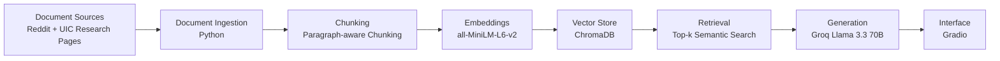

# Project 1 Planning: The Unofficial Guide

> Write this document before you write any pipeline code.
> Your spec and architecture diagram are what you'll use to direct AI tools (Claude, Copilot, etc.) to generate your implementation — the more specific they are, the more useful the generated code will be.
> Update the Retrieval Approach and Chunking Strategy sections if you change your approach during implementation.
> Update this file before starting any stretch features.

---

## Domain

This project focuses on student experiences and research opportunities in the Computer Science department at the University of Illinois Chicago (UIC). The system combines unofficial student discussions from Reddit with official information from UIC research laboratories and research-area pages.

This knowledge is valuable because official university websites describe research areas, laboratories, and faculty members, but they do not explain how students actually find research positions, communicate with professors, join research groups, or experience lab culture. Students often share this practical information through online discussions and community forums, making it difficult to find through official channels.
---

## Documents

<!-- List your specific sources: URLs, subreddit names, forum threads, or file descriptions.
     Aim for at least 10 sources that together cover different subtopics or perspectives within your domain. -->

| #  | Source                                          | Description                                                                                       | URL or location                                                                                       |
| -- | ----------------------------------------------- | ------------------------------------------------------------------------------------------------- | ----------------------------------------------------------------------------------------------------- |
| 1  | Research in the CS at UIC                       | Reddit discussion about undergraduate CS research opportunities and contacting professors         | https://www.reddit.com/r/uichicago/comments/15fzeez/research_in_the_cs_at_uic/                        |
| 2  | How to Get Into Research?                       | Reddit discussion about finding research opportunities as a transfer student                      | https://www.reddit.com/r/uichicago/comments/met23h/how_to_get_into_research/                          |
| 3  | How Do I Get Into Research?                     | Reddit discussion about emailing professors and finding undergraduate research positions          | https://www.reddit.com/r/uichicago/comments/1e95n83/how_do_i_get_into_research/                       |
| 4  | UIC Computer Science Research                   | Reddit discussion about undergraduate CS research opportunities at UIC                            | https://www.reddit.com/r/uichicago/comments/1j5cgjx/uic_computer_science_research/                    |
| 5  | Classes or Research Labs You Loved              | Reddit discussion describing positive research lab experiences and faculty mentorship             | https://www.reddit.com/r/uichicago/comments/hkziru/all_majors_what_are_some_classes_or_research_labs/ |
| 6  | High School Research Opportunities              | Reddit discussion about entering research labs and contacting faculty members                     | https://www.reddit.com/r/uichicago/comments/16a8kqs/high_school_research_opportunities/               |
| 7  | UIC Artificial Intelligence Laboratory Projects | Official AI Lab projects including machine learning, data mining, and text summarization research | https://ai.uic.edu/projects/                                                                          |
| 8  | DBMC Moving Objects Databases Project           | Official Database and Mobile Computing Laboratory project description                             | https://dbmc.lab.uic.edu/projects/moving-objects-databases/                                           |
| 9  | About EVL                                       | Official description of the Electronic Visualization Laboratory and its research focus            | https://www.evl.uic.edu/about/                                                                        |
| 10 | UIC Research Areas Booklet                      | Official UIC Computer Science research areas, faculty expertise, and laboratory information       | https://cs.uic.edu/cs-research/research-areas-2/                                                      |

---

## Chunking Strategy

<!-- How will you split documents into chunks?
     State your chunk size (in tokens or characters), overlap size, and explain why those
     numbers fit the structure of your documents.
     A review-heavy corpus warrants different chunking than a long FAQ. -->

**Chunk size:800 characters**

**Overlap:100 characters**

**Reasoning:**
The document collection contains two different types of content: Reddit discussions and official UIC research pages. Reddit discussions are made up of short posts and comments that often contain complete pieces of advice in a few paragraphs, while the official research pages contain longer descriptions of laboratories, projects, and faculty research areas.

I will use paragraph-aware chunking with a target size of approximately 800 characters and an overlap of 100 characters. This size is large enough to preserve complete ideas such as research advice, student experiences, or laboratory descriptions, while remaining small enough for precise retrieval. The overlap helps preserve context when important information appears near chunk boundaries and reduces the risk of losing relevant details during retrieval.
---

## Retrieval Approach

<!-- Which embedding model are you using (e.g., all-MiniLM-L6-v2 via sentence-transformers)?
     How many chunks will you retrieve per query (top-k)?
     If you were deploying this for real users and cost wasn't a constraint, what tradeoffs
     would you weigh in choosing a different embedding model — context length, multilingual
     support, accuracy on domain-specific text, latency? -->

**Embedding model:all-MiniLM-L6-v2 (Sentence Transformers)**

**Top-k: 5**

**Production tradeoff reflection:**
selected all-MiniLM-L6-v2 because it is free, lightweight, and runs locally without requiring an API key. It provides good semantic search performance for a relatively small document collection.

If I were deploying this system for real users and cost was not a concern, I would evaluate larger embedding models that provide stronger semantic understanding, longer context handling, and better support for domain-specific language. I would also consider multilingual support, latency requirements, infrastructure cost, and whether the model should run locally or through a hosted API service.
---

## Evaluation Plan

<!-- List your 5 test questions with their expected correct answers.
     Questions should be specific enough that you can judge whether the system's response
     is right or wrong. "What are good dining halls?" is too vague.
     "What do students say about wait times at [dining hall name] during lunch?" is testable. -->

| # | Question | Expected answer |
|---|----------|-----------------|
| 1 | How do UIC students recommend getting involved in undergraduate research? | Students recommend contacting professors directly, expressing interest in their research, and applying to available research opportunities. |
| 2 | What advice do students give when emailing professors about research positions? | Students recommend sending personalized emails that reference a professor’s research interests rather than sending generic messages. |
| 3 | What research topics are covered by the UIC Artificial Intelligence Laboratory? | The AI Lab conducts research in machine learning, data mining, intelligent systems, and text summarization. |
| 4 | What is the primary focus of the Electronic Visualization Laboratory (EVL)? | EVL focuses on visualization, virtual reality, advanced computing, networking, and large-scale data exploration. |
| 5 | What skills or preparation do students recommend before joining a research lab? | Students recommend developing programming skills, taking relevant CS courses, and demonstrating interest in a professor’s research area. |

---

## Anticipated Challenges

<!-- What could go wrong? Name at least two specific risks with reasoning.
     Consider: noisy or inconsistent documents, missing source attribution, off-topic
     retrieval, chunks that split key information across boundaries. -->

1.Reddit discussions contain informal language, deleted comments, and off-topic conversations. These may introduce noise into the document collection and negatively affect retrieval quality.

2.Important information may be spread across multiple comments or document sections. If chunk boundaries split related information, retrieval may return incomplete context and reduce answer quality.

---

## Architecture

<!-- Draw a diagram of your pipeline showing the five stages:
     Document Ingestion → Chunking → Embedding + Vector Store → Retrieval → Generation
     Label each stage with the tool or library you're using.
     You can use ASCII art, a Mermaid diagram, or embed a sketch as an image.
     You'll use this diagram as context when prompting AI tools to implement each stage. -->

---

## AI Tool Plan

<!-- For each part of the pipeline below, describe:
     - Which AI tool you plan to use (Claude, Copilot, ChatGPT, etc.)
     - What you'll give it as input (which sections of this planning.md, which requirements)
     - What you expect it to produce
     - How you'll verify the output matches your spec

     "I'll use AI to help me code" is not a plan.
     "I'll give Claude my Chunking Strategy section and ask it to implement chunk_text()
     with my specified chunk size and overlap" is a plan. -->

**Milestone 3 — Ingestion and chunking:**
I will use Codex to help implement document ingestion, text cleaning, and chunking functions. I will provide the Domain, Documents, and Chunking Strategy sections from this planning document. I expect Codex to generate Python code that loads documents from the docs folder, removes unnecessary content, and creates chunks according to my specified chunk size and overlap. I will verify the implementation by manually reviewing sample chunks and confirming they preserve complete ideas.

**Milestone 4 — Embedding and retrieval:**
I will use Codex to generate embedding and retrieval code using Sentence Transformers and ChromaDB. I will provide the Retrieval Approach section and architecture diagram. I expect Codex to create code for generating embeddings, storing vectors with metadata, and retrieving relevant chunks using semantic similarity search. I will verify the implementation by testing several queries and evaluating the relevance of the retrieved chunks.

**Milestone 5 — Generation and interface:**
I will use Codex to help build the retrieval-augmented generation pipeline and Gradio interface. I will provide the grounding requirements and desired output format. I expect Codex to generate code that combines retrieval results with an LLM prompt, generates grounded answers, and displays source citations. I will verify the implementation by testing both answerable and unanswerable questions and checking that every response includes source attribution.